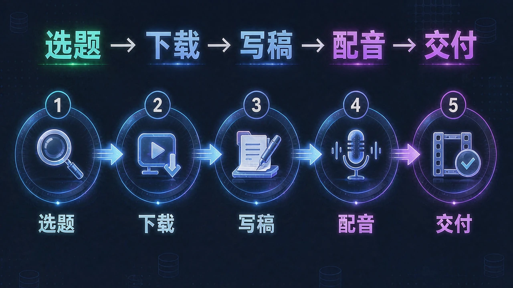

# AutoYY

<!-- README-PROMO:START -->
<p align="center">
  
  
  
</p>
<!-- README-PROMO:END -->

<h3 align="center">YouTube 纪录片解说自动化技能 · 从选题到中文口播稿与配音</h3>

<p align="center">
  
  
  
  
</p>

> **AutoYY** 是一个面向纪录片二创博主的工作流技能：输入 YouTube 长视频选题，自动完成**素材与字幕下载 → 中文口播稿撰写 → 去 AI 味 → 事实核验 → 独立审校 → 封面生成 → 配音合成**，产出可发布的内容包。
>
> 让 AI 帮你跑完纪录片二创最耗时的部分，你只负责最后把关和发布。

---

## 它能做什么

| 阶段 | 产出 | 说明 |
|---|---|---|
| 📊 选题规划 | 选题候选 + 表现数据 | 从榜单与话题调研中筛选可做的长视频 |
| ⬇️ 素材准备 | 视频 + 字幕（SRT） | `yt-dlp` 自动下载，支持断点续跑与防封策略 |
| ✍️ 口播稿 | `爆款口播稿.txt` | 基于原片字幕的第三人称中文解说稿 |
| 🧹 AI 去味 | 自然化改稿 | 内置 Humanizer，消除 AI 腔调且零事实漂移 |
| ✅ 质量门禁 | 质量记录 + 校验结果 | 事实核验、独立审校、批量质量闸门 |
| 🖼️ 封面 | 3:4 / 4:3 封面提示词与成图 | 严格字数校验，拒绝无效标题 |
| 🎙️ 配音 | 配音稿 + 音频 | 无缝对接 GPT-SoVITS 等 TTS 引擎 |
| 📦 交付 | 完整发布包 | 成稿、配音稿、封面、发布信息一次产出 |

---

## 为什么这个版本更严格

多选题批量写作不能为了产能牺牲质量。AutoYY 把**每个选题当成独立单元**：一份源上下文、一份候选稿、一轮 Humanizer、一次事实核验、一个独立审校结果、一道确定性闸门。**只有所有选题都通过，这一批才算完成。**

最终稿 `爆款口播稿.txt` **不允许被直接写出**。写手只能产出 `爆款口播稿.candidate.txt`，只有当前源文件/稿件哈希与全部质量闸门都通过后，AutoYY 才会把它提升为正式稿。

---

## 环境要求

- **Windows 10/11** 为主要支持平台
- **Python 3.11+**
- `yt-dlp`、`ffmpeg`、`ffprobe`（媒体流程必需）
- 建议安装 Node 或 Deno（用于新版 YouTube 提取）
- `aria2` 可选，用于加速下载
- `FunASR` 或 `faster-whisper` 可选，用于本地字幕回退识别

设置 `AUTOYY_WORK_ROOT` 可指定默认项目输出根目录；Windows 下回退到 `D:\自动剪辑`。

---

## 安装

```powershell
git clone https://github.com/DaBaoAgent/AutoYY.git
cd AutoYY
python -m pip install -e ".[dev]"
python -m autoyy doctor
```

作为 Agent Skill 安装时，把仓库克隆或软链到对应 Agent 的 skills 目录即可。**生产产物请放在技能仓库之外**，避免污染仓库。

---

## 快速开始

```powershell
# 环境自检
python -m autoyy doctor

# 查看可用能力与资源
python -m autoyy resources

# 校验既有产物并规划运行
python -m autoyy runtime reconcile <project-root> --dry-run
python -m autoyy runtime plan <project-root> --manifest <manifest.csv>

# 无人值守运行（自动执行确定性阶段）
python -m autoyy runtime run <project-root> --manifest <manifest.csv>

# 前台守护进程（含心跳、重启恢复、重试台账）
python -m autoyy supervisor run <project-root> --manifest <manifest.csv> --stop-when-idle
python -m autoyy supervisor status <project-root>

# 查看历史性能信号（p50 / p95 / 失败率）
python -m autoyy history <project-root>

# 批量状态与调度
python -m autoyy batch plan <project-root> voiceover
python -m autoyy work claim <project-root> --worker-id <run-id> --stage voiceover
python -m autoyy voiceover validate <project-root> --workers 4

# 全链路校验
python -m autoyy validate <project-root> --workers 4
python -m autoyy publication validate <project-root>
```

`--json` 可放在子命令前后任意位置，输出便于 Agent 解析的紧凑 JSON。

---

## 批量口播稿质量契约

两个及以上选题时，**一个选题对应一个 worker/上下文**是机器强制的租约流程，不只是提示词约定：

```powershell
python -m autoyy batch plan <project-root> voiceover
python -m autoyy work claim <project-root> --worker-id <run-id> --stage voiceover
```

持有活跃租约的 worker 再次被分配时仍会拿到同一个选题，不会占用新的目录。**禁止把多个 SRT 拼接成一份提示词。**

每个选题的流程：

1. 领取一个选题并保持租约心跳
2. 通读该选题完整的 `字幕.srt`（摘要仅供导航）
3. 写 `爆款口播稿.candidate.txt`（不是最终文件名），并生成质量脚手架
4. 以 Embedded 模式运行内置的 `blader-humanizer`
5. 执行源锚定的事实核验与独立语义审校
6. 写入 `.autoyy/voiceover-quality.json`（含当前源/稿 SHA-256、全读标记、各环节通过状态与证据条目）
7. 执行 `python -m autoyy voiceover promote <topic-folder>` 提升为正式稿
8. 提交审校完成后再释放租约，领取下一个选题

质量闸门会校验：非空白字符 4500–5500、至少 5 处源自素材的直接引用、数值型论断有据、证据锚点覆盖率、AI/模板化写法黑名单、重复段落检测，以及**跨选题雷同检测**。任一选题失败，整批标记 `INCOMPLETE` 并返回退出码 1。

---

## 断点状态

每个生产项目可包含 `.autoyy/state.json`，记录各阶段状态与源文件、字幕、口播稿、发布信息、封面、打包校验的非敏感指纹。上游指纹变化会把依赖的已就绪阶段标记为过期；状态文件损坏会被**报告而非静默替换**。已就绪阶段可显式批准，强制或修改上游指纹会撤销相关批准。

---

## 性能与可观测性

长时间下载/ASR 工作会把结构化事件追加到 `<project>/.autoyy/events.jsonl`：本地存储、10 MiB 轮转、包含 run ID、选题/阶段状态、耗时与稳定错误码。这是**本地日志，不是远程遥测**。

- 大媒体文件使用采样指纹（大小 + 首/中/尾 SHA-256），不再整文件重读
- 下载默认与字幕发现重叠执行
- Worker 并发度自适应：出现大量可重试的网络/限流失败时自动降档，稳定后逐步回升
- `transcribe --device auto` 仅在有可用 NVIDIA GPU 时选 CUDA，CUDA/CUDNN/OOM 失败自动回退 CPU

---

## 封面工作流

- `gen_jimeng_cover_prompts.py`：生成严格的 3:4 与 4:3 外部生图提示词，标题必须正好 6+8 字，否则拒绝
- `build_topic_covers_from_video.py`：本地确定性回退方案，需显式提供封面文案、Pillow、ffmpeg/ffprobe 与字体

---

## 测试

```powershell
python -m compileall -q scripts src
python -m pytest -q
python -m pytest --cov=autoyy --cov-report=term-missing --cov-fail-under=85 -q
python -m ruff check .
git diff --check
```

CI 在 Windows + Python 3.11/3.12 上运行，且不依赖实时 YouTube 访问。

---

## 常见问题

先跑 `python -m autoyy doctor`。缺少可选 ASR 后端或 aria2 不会阻塞无关阶段。失败的项目阶段应**修复后断点续跑**，不要强行改成就绪状态或删除已批准的产物。

---

## 贡献与许可

欢迎 Issue 与 Pull Request。

本项目以 [MIT License](LICENSE) 发布。内置第三方代码保留各自的许可声明，详见 `vendor/blader-humanizer/LICENSE`。

---

<p align="center">
  <sub>Made with ❤️ by <a href="https://github.com/DaBaoAgent">Dabao</a></sub>
</p>
